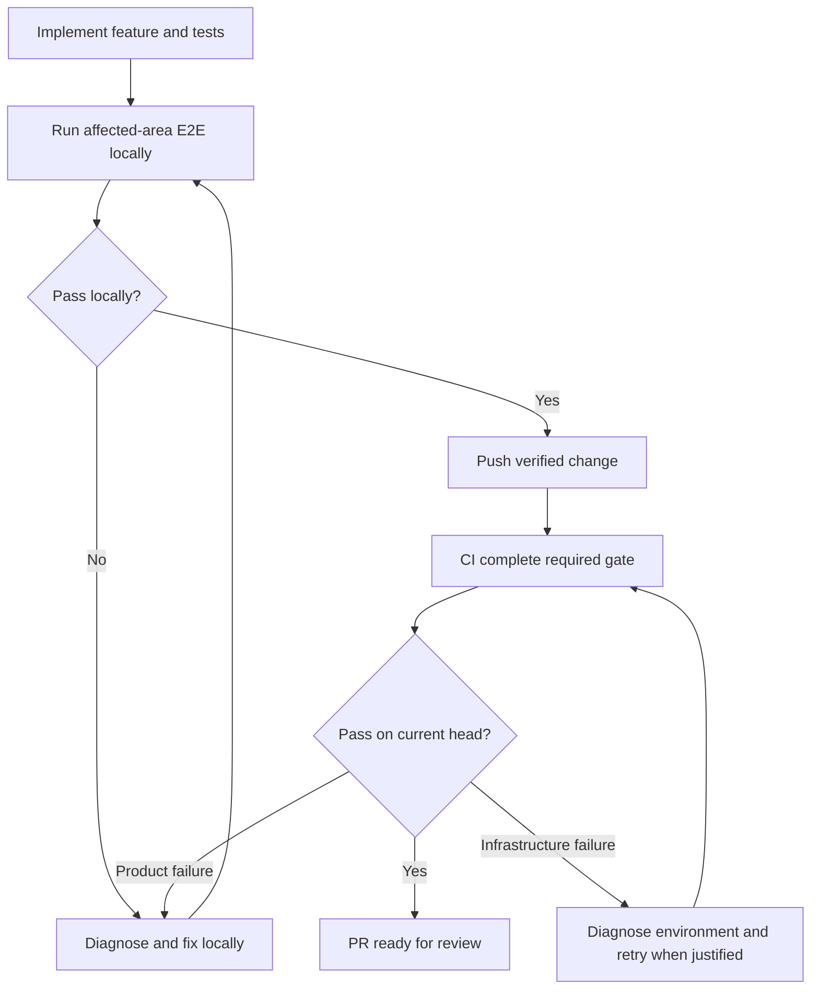

# Agent workflow

Use affected-area local E2E as the development loop. Push a locally verified
change, then use CI for the project's complete required regression gate. A full
local E2E run is justified by the change's impact, not required on every iteration.

If a cloud agent cannot access the local test environment, read
[the cloud exception](references/cloud-environment.md). It requires a warning and
access request at the top of the PR while allowing continued CI-backed work.

## Bind to the repository

Read the repository and app agent guides, test guide, package scripts, test
configuration and CI workflows. Identify the owned runtime, setup dependencies,
affected-area selection, complete CI gate, cleanup and report paths. Keep project
commands and credentials in those sources rather than copying another app's setup.

Work in the repository's prescribed isolated checkout. Honor its contract-first,
authentication, tenant-scope and CLI/MCP parity requirements. Use public setup APIs
and disposable data in the owned test environment.

Locate the project's E2E guide and project-owned review adapter when present.
Affected-suite planners and manual spec selection have different semantics;
inspect the actual scripts and flags. A deployed smoke suite does not replace
isolated E2E.
When reading this skill by raw URL, resolve supporting links from the same
repository and ref.

## Implement with local feedback

1. Define the changed behavior and its acceptance criteria, including persistence,
   permissions and failure states where relevant. Map it to owning scenarios and
   affected consumers. Use the project's impact planner when available; otherwise
   select the relevant area explicitly. Include setup dependencies and existing
   regressions alongside new or modified tests.
2. Extend tests and implement the feature. For a reproduced defect, establish the
   failing outcome before its repair. Prove user outcomes through the browser or
   supported public API, with reload or read-back where persistence matters.
3. Run that affected area's E2E locally against the current worktree, plus relevant
   component, contract, lint, type or build checks. Verify actual scenario matches,
   results and source identity; discovery or test authoring alone is not execution.
   Diagnose failures and repeat the local selection after repairs. Keep test
   assertions and runtime ownership intact.
4. Broaden local selection when shared authentication, routing, fixtures, runtime
   or backend contracts affect other journeys. Use the complete local suite when
   the impact or repository rules warrant it. Reuse a matching owned runtime when
   supported; rebuild after source changes and verify cleanup when its owner exits.
5. For browser-visible changes, use
   [feature-review](../feature-review/SKILL.md) and the project adapter for affected
   responsive journeys, inspected media and independent validation. Keep this
   selection focused on changed behavior and its consumers.

The normal pre-push gate is passing affected-area local E2E and applicable local
checks on the final relevant source. Record the selection, commands, tested source,
results and any coverage boundary. Missing runtime access is the cloud exception;
a failing product assertion remains a failure to fix.

## Push and verify in CI

Commit, push and open or update the PR according to existing authorization and
repository conventions. Confirm that CI actually selects the new tests and runs
the complete required gate, including setup and cleanup. Keep source checks and
application E2E results distinct when they are separate workflows.

Wait for the results on the current PR head. For a product failure, reproduce it
locally in the affected area, repair it, rerun the local selection and then push.
For a runner or provider failure, retain its evidence and retry only after a
confirmed transient condition or a relevant correction. Repeated identical failures
without new evidence require diagnosis or a concrete access/input request, not
blind reruns.

## Report completion

The PR records changed behavior, executed local selection and results, current-head
CI links/results, relevant visual evidence and remaining limitations. Preserve the
repository's template and automation markers. A cloud warning stays at the top
until the affected local E2E has actually passed after access is restored.

Call the feature ready for review only after the required CI gates and applicable
review requirements pass. Under the cloud exception, state explicitly that local
E2E remains unexecuted or partial; CI success does not turn it into a local pass.
Creating a skill or completing this workflow does not authorize merging, deploying
or changing shared infrastructure or credentials.
