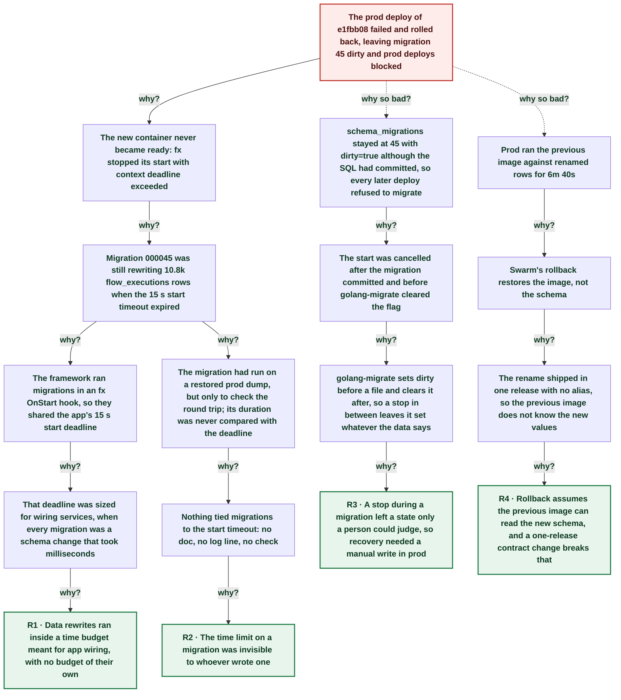

# Prod deploy rolled back: migration 000045 outran the 15 s start timeout

| | |
|---|---|
| **Date** | 2026-10-01 |
| **Severity** | SEV3 |
| **Status** | In review |
| **Service** | application-service |
| **Authors** | Service engineering |
| **Duration** | 6m 40s (trigger to resolution) |
| **Time to detect** | 4m 13s |
| **Time to mitigate** | ~5m 29s |

> Blameless: this document names systems, processes and missing guards, not people.

## Summary

Illustrative anonymized scenario; source links are placeholders. The prod deploy of application-service `e1fbb08` failed. Migration 000045 renames flow extractor and operator values to snake_case across 10.8k `flow_executions` rows, and it was still running when the app's 15 s start timeout expired. Swarm rolled the service back to the previous image, but the migration had already committed, so `schema_migrations` stayed at version 45 with `dirty=true` and blocked every later deploy. The data was checked by hand, the flag cleared and the deploy rerun, which went live 6m 40s after it started. shared-framework v0.15.0 now runs migrations before start, outside that deadline.

## Impact

No customer saw an error: no client used the old values yet, which is why the rename shipped as one big change. For 6m 40s prod ran the previous image against rows the migration had already renamed, values that image does not know. Application service prod deploys were blocked until the dirty flag was cleared.

- **6m 40s** from prod deploy start to the new image healthy
- **10.8k** flow_executions rows rewritten by the migration
- **0** customer reports
- **1** manual write to the prod database

## Trigger

The prod deploy job started the new application-service container. Its start ran migration 000045 inside the fx start hook, which has 15 s to finish.

## Detection

The router's `Deploy application-service to prod` job failed at 16:39:14 with `context deadline exceeded`, seen by the person watching the deploy. No alert fired: a deploy that rolls back leaves prod serving, so the health checks stayed green.

## Resolution

Confirmed the migration had committed in full (no camelCase values left, triggers enabled), ran `UPDATE schema_migrations SET dirty=false WHERE version=45`, then reran the failed router job. The new image started against an already migrated schema, so it booted inside the deadline.

## Timeline (UTC)

| Time | | Event |
|---|---|---|
| 16:25:53 | T−9m 08s | **PR #425 merged with migration 000045** snake_case extractor and operator values, one release, no alias for the old values. ([link](https://example.invalid/example-org/application-service/pull/425)) |
| 16:31:48 | T−3m 13s | **Dev flow suite fails on the first run** The rerun at 16:34:21 passes and the router moves on to prod. Dev's tables are small, so the same migration finished well inside 15 s there. |
| 16:35:01 | T+0s | **Prod deploy starts, migration runs on start** 10.8k `flow_executions` rows to rewrite inside the 15 s fx start deadline. |
| 16:39:14 | T+4m 13s | **Prod job fails: context deadline exceeded** Swarm rolls back to the previous image. `schema_migrations` is left at 45 with `dirty=true`. ([link](https://example.invalid/example-org/infra/actions/runs/36892442982)) |
| ~16:40 | T+5m 29s | **Data checked, dirty flag cleared by hand** 0 camelCase rows, triggers enabled, then `UPDATE schema_migrations SET dirty=false WHERE version=45`. |
| 16:40:47 | T+5m 46s | **Failed prod job rerun** `gh run rerun <router run> --failed` |
| 16:41:41 | T+6m 40s | **e1fbb08 healthy on prod** The new image boots against the migrated schema in time. The frontend is promoted at 16:41:54. |
| 17:06:15 | T+31m 14s | **shared-framework v0.15.0 merged** Migrations run in `fx.Invoke`, before every `OnStart` and without its deadline. SIGTERM during a migration finishes the current file, then exits. ([link](https://example.invalid/example-org/shared-framework/pull/43)) |
| 19:04:04 | T+2h 29m | **application-service and identity-service move to v0.15.0** application-service #427 and identity-service #161. ([link](https://example.invalid/example-org/application-service/pull/427)) |

## Root cause analysis: the five whys

Start at the impact and ask why until the answer is something the team can change. Solid edges ask why it happened; dashed edges ask why the impact was as large as it was.

- **Problem:** The prod deploy of e1fbb08 failed and rolled back, leaving migration 45 dirty and prod deploys blocked
  - **Why?** The new container never became ready: fx stopped its start with context deadline exceeded _Evidence: [Deploy application-service to prod, attempt 2](https://example.invalid/example-org/infra/actions/runs/36892442982)_
    - **Why?** Migration 000045 was still rewriting 10.8k flow_executions rows when the 15 s start timeout expired _Evidence: row count from the full prod dump taken before the change_
      - **Why?** The framework ran migrations in an fx OnStart hook, so they shared the app's 15 s start deadline _Evidence: shared-framework before v0.15.0_
        - **Why?** That deadline was sized for wiring services, when every migration was a schema change that took milliseconds
          - **Why?** Data rewrites ran inside a time budget meant for app wiring, with no budget of their own → **Root cause R1** (fixed by A1, A3, A6)
      - **Why?** The migration had run on a restored prod dump, but only to check the round trip; its duration was never compared with the deadline _Evidence: the byte-identical up and down check on the restored dumps_
        - **Why?** Nothing tied migrations to the start timeout: no doc, no log line, no check
          - **Why?** The time limit on a migration was invisible to whoever wrote one → **Root cause R2** (fixed by A4, A5)
  - **Why so bad?** schema_migrations stayed at 45 with dirty=true although the SQL had committed, so every later deploy refused to migrate
    - **Why?** The start was cancelled after the migration committed and before golang-migrate cleared the flag
      - **Why?** golang-migrate sets dirty before a file and clears it after, so a stop in between leaves it set whatever the data says
        - **Why?** A stop during a migration left a state only a person could judge, so recovery needed a manual write in prod → **Root cause R3** (fixed by A2, A3)
  - **Why so bad?** Prod ran the previous image against renamed rows for 6m 40s
    - **Why?** Swarm's rollback restores the image, not the schema
      - **Why?** The rename shipped in one release with no alias, so the previous image does not know the new values
        - **Why?** Rollback assumes the previous image can read the new schema, and a one-release contract change breaks that → **Root cause R4** (fixed by A7)

## Root causes

- **R1** Data rewrites ran inside a time budget meant for app wiring, with no budget of their own
- **R2** The time limit on a migration was invisible to whoever wrote one
- **R3** A stop during a migration left a state only a person could judge, so recovery needed a manual write in prod
- **R4** Rollback assumes the previous image can read the new schema, and a one-release contract change breaks that

## Contributing factors

- The post-deploy flow suite that gates prod runs against the dev control plane, so it cannot see a problem that only prod's data size causes.
- The dev deploy passed with the same migration because dev's `flow_executions` is much smaller, which read as a green light for prod.

## Lessons learned

### What went well

- Full dumps of both databases were taken before the change, so the data could be checked, and restored if it had come to that.
- The migration was reversible and verified byte-identical on a round trip, which made clearing the flag by hand safe to reason about.
- The framework fix merged 25 minutes after resolution and reached both apps the same day.

### What went wrong

- The limit that killed the deploy was not written down anywhere a migration author would look.
- Recovery needed a manual `UPDATE` on the prod database.
- Dev passed with the same migration, so the dev deploy gave false confidence.

### Where we got lucky

- No client used the old values, so 6m 40s of the previous image over renamed rows broke nobody.
- The migration committed in full before the cancel. A cancel halfway through a migration outside one transaction would have left half-renamed rows.
- The table was small enough for the migration to finish. One that runs past about 90 s is killed by the container healthcheck, which v0.15.0 does not change.

## Action items

| ID | Action | Type | Owner | Due | Status | Ticket | Fixes |
|---|---|---|---|---|---|---|---|
| A1 | Run migrations in `fx.Invoke`, before every `OnStart`, without the start deadline | prevent | shared-framework | 2026-10-01 | done | [shared-framework#43](https://example.invalid/example-org/shared-framework/pull/43) | R1 |
| A2 | On SIGTERM during a migration, finish the current file and leave the version clean before exiting | mitigate | shared-framework | 2026-10-01 | done | [shared-framework#43](https://example.invalid/example-org/shared-framework/pull/43) | R3 |
| A3 | Move application-service and identity-service to framework v0.15.0 | prevent | application-service, identity-service | 2026-10-01 | done | [application-service#427](https://example.invalid/example-org/application-service/pull/427) | R1, R3 |
| A4 | Log each migration's duration at boot and warn when it passes half of the healthcheck window | detect | shared-framework | 2026-10-15 | open |  | R2 |
| A5 | Time every data migration against a restored prod dump before merge and write the duration in the PR | process | application-service | 2026-10-15 | open |  | R2 |
| A6 | Move rewrites that can run past the 90 s healthcheck to a pgqueue backfill job instead of a start-time migration | prevent | application-service | 2026-10-31 | open |  | R1 |
| A7 | Ship a contract value change used by live clients over two releases: accept old and new values first, so a rollback stays safe | process | application-service | 2026-10-15 | open |  | R4 |

## Responders

- **Incident lead**: On-call engineer
- **Diagnosis and framework fix**: Claude Code agent

## Messaging

### Internal

application-service prod deploy of e1fbb08 failed at 16:39 UTC: migration 000045 outran the 15 s start timeout and left migration 45 dirty. Data verified complete, flag cleared, redeployed and healthy at 16:41. No customer impact. Framework fix in shared-framework v0.15.0 (#43).

## Supporting information

- [Router run with the failed and rerun prod job](https://example.invalid/example-org/infra/actions/runs/36892442982)
- [application-service #425: snake_case values and migration 000045](https://example.invalid/example-org/application-service/pull/425)
- [shared-framework #43: migrations before start](https://example.invalid/example-org/shared-framework/pull/43)
- [identity-service #161: framework v0.15.0](https://example.invalid/example-org/identity-service/pull/161)
